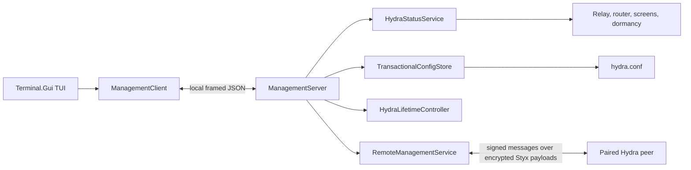

# Hydra TUI architecture

Status: implemented on the fork's `main` branch

Last reviewed: 2026-08-29

`hydra tui` is Hydra's sole interactive configuration editor and its local operational control center. This document records the current architecture and the constraints future changes must preserve. User instructions belong in [CONFIGURATION.md](CONFIGURATION.md); this is not a delivery roadmap.

## Process modes

The same self-contained executable supports three entry modes:

```text
hydra                         Run Hydra normally
hydra tui                     Open the local management TUI
hydra tui --config <path>     Manage the instance for a specific config path
hydra pair                    Generate a one-time remote-management pairing code
hydra pair --config <path>    Pair the instance for a specific config path
```

The TUI is a separate process from the Hydra daemon. Closing it does not stop Hydra. CLI dispatch for `tui` and `pair` occurs before normal daemon startup in `Hydra/Program.cs`.

## Architecture



The principal implementation areas are:

- `Hydra/Tui/HydraTui.cs`: Terminal.Gui views and interaction coordination.
- `Hydra/Management/ManagementClient.cs` and `ManagementServer.cs`: local request/response boundary.
- `Hydra/Management/HydraStatusService.cs`: immutable runtime snapshots.
- `Hydra/Management/TransactionalConfigStore.cs`: validated, revision-aware config replacement.
- `Hydra/Management/GuidedConfigDocument.cs`: patch-in-place guided editing of retained JSON.
- `Hydra/Management/RemoteManagementService.cs`: paired remote requests over the existing encrypted relay.
- `Hydra/Management/RemoteApplyStore.cs`: last-known-good backup, confirmation, and rollback.

## Local management boundary

Local management uses a versioned, four-byte length-prefixed JSON protocol with a 2 MiB frame limit and at most 16 active request handlers. The endpoint identity is derived from the canonical configuration path so multiple Hydra instances do not collide.

- macOS and Linux use a user-private Unix socket directory and socket.
- Windows uses a named pipe restricted to the intended local security context.
- No TCP management listener is opened.
- The client validates the server protocol version and instance identity before using it.
- Logs and snapshots are bounded and must never contain configuration secrets, clipboard content, file content, or captured input.

Changing framing, endpoint identity, permissions, protocol versioning, or request limits requires focused management tests and platform-specific validation.

## Configuration ownership

`HydraConfigFile.Parse` and `HydraConfig.Validate` are the only canonical parser and validator. The TUI must not maintain a second schema.

The configuration view has two representations of the same retained source document:

- **Form** patches common fields through `GuidedConfigDocument`.
- **Text** edits the complete JSON document.

The form must preserve unknown, advanced, and topology fields it does not expose. It must never serialize the mirror-expanded runtime host graph back to disk. Switching between Form and Text must not change semantics on its own.

Saving is revision-aware and validates before replacing the original through a sibling temporary file. Preserve private file permissions, external-change detection, and the distinction between **Save** and **Save & Restart**. Offline editing remains available when the daemon is unavailable, but the TUI must not assume that any connection failure means Hydra is stopped.

Secrets are masked by default. Revealing them is an explicit local action, and remote reads are redacted at the source.

## Remote management boundary

Remote administration is opt-in and separate from ordinary relay authentication.

1. The target creates a single-use code with `hydra pair`; it expires after 10 minutes.
2. Pairing establishes separate controller credentials stored beside the config in a private sidecar.
3. Requests are signed, timestamped, nonce-protected, size-limited, and carried inside Hydra's encrypted Styx payloads.
4. Remote config reads are redacted before leaving the target.
5. Apply is revision-aware and rejects connectivity-defining edits that could remove the recovery path.
6. A candidate must reconnect on the expected revision and be confirmed within 90 seconds or the target restores its last-known-good config.
7. Expired or invalid candidates are recovered during bootstrap before normal config use.

Do not expose the local IPC endpoint over the network, reuse ordinary relay passwords as management authority, log sidecar contents, or weaken rollback to make remote apply appear more reliable.

## Runtime and lifecycle behavior

The TUI reports status, active profile, relay route, network adapters, embedded-relay peers, latency, send-queue depth/age, screens, routing state, and bounded logs. Runtime controls include reconnect, restart, shutdown where supported, and a guarded start after the TUI itself confirmed shutdown.

Platform lifecycle behavior is intentionally different:

- **macOS:** shutdown unloads but preserves the LaunchAgent; start can load the installed agent or launch the current executable.
- **Windows:** a service-managed session child must not stop or replace the service. Stop/start remains an elevated service operation.
- **Linux:** Hydra does not own a service installer; report direct or externally supervised operation without assuming systemd.

Restart, shutdown, or start changes must preserve the owning supervisor's semantics and must never create duplicate Windows session children. Routine tests must not restart an installed Hydra instance.

## UI and performance rules

- Terminal.Gui remains isolated under `Hydra/Tui/`; management contracts must not depend on widget types.
- Background work marshals UI changes onto Terminal.Gui's application loop.
- Refresh and log polling stay bounded and cancellable.
- Input callbacks never wait for TUI, logging, status, or configuration work.
- Commands display accepted/in-progress/completed state without blocking normal refresh behind success dialogs.
- Unsupported controls are shown honestly rather than emulated with unsafe platform guesses.
- The TUI must restore the terminal cleanly after normal exit and failures.

## Validation

For TUI or management changes, run focused tests first, then the Release solution build. Select additional lanes based on the behavior changed:

- config editing: parser/validation, `GuidedConfigDocument`, secret masking, transactional save, and external-revision tests;
- local management: framing, endpoint permission/identity, client/server, log-buffer, and lifecycle tests;
- remote management: pairing, signatures, replay/freshness, redaction, connectivity guard, revision conflict, confirmation, expiry, and rollback tests;
- platform lifecycle: the affected macOS, Windows, or Linux lane plus an explicit live gap when no safe runtime environment exists;
- packaging: self-contained publishes for affected release RIDs and representative terminal smoke tests.

A macOS test run does not prove Windows named-pipe ACLs, Windows service behavior, Linux terminals, or X11 behavior. Cross-target publishing proves packaging, not runtime behavior.

## Known structural debt

`HydraTui.cs` still coordinates view construction, polling, formatting, local commands, remote apply, and config binding in one large controller. Split it only after deterministic interaction tests exist, keeping the local management protocol and the daemon-side ownership boundaries unchanged.

Invalid or missing first-time configurations still require local or out-of-band bootstrap. The offline editor can repair an existing file, but the management daemon does not start before configuration bootstrap.
