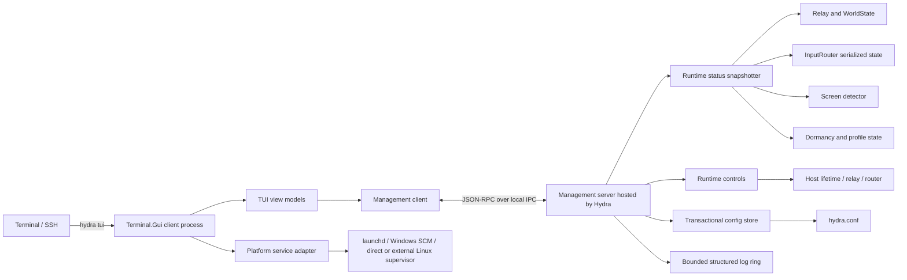

# Cross-platform Hydra TUI plan

Status: proposed

Date assessed: 2026-08-23

Scope: architecture and implementation plan only; no TUI or runtime-control code has been implemented

## Executive decision

Build the TUI in C# on .NET 10 with **Terminal.Gui v2**, and expose it as a new mode of the existing executable:

```text
hydra tui
```

`hydra tui` will be a separate process from the normally running Hydra daemon, even though both modes are compiled into the same self-contained executable. The daemon will expose a versioned, local-only management API over an operating-system-native IPC transport. The TUI will use that API for live state, monitoring, and controls, and will use Hydra's canonical C# configuration parser and validator for configuration work.

This is preferable to a second Rust, Go, or TypeScript application because it:

- preserves the current one-binary release and self-update model;
- reuses the exact .NET configuration model and validation rather than creating a third schema implementation;
- can read Hydra's internal runtime state without extending the Styx network protocol;
- shares the repository's .NET 10 toolchain, tests, publishing matrix, and platform abstractions;
- avoids packaging and atomically updating a companion executable;
- still keeps terminal rendering out of the long-running input and relay process.

Terminal.Gui should be isolated behind `Hydra/Tui/` so the library can be replaced without changing the management protocol or runtime instrumentation.

## What “cross-platform” means

The same `hydra tui` command and core screens must work on macOS, Windows, Linux/X11, and headless Linux over a real terminal or SSH session. Platform-specific service operations may have different capabilities, and the UI must show unsupported operations explicitly rather than pretending every platform has the same supervisor.

The first release manages the **local Hydra instance**. It may display the peers and screens already known to that instance, but it does not remotely administer other Hydra machines. Remote administration would add a new security boundary and protocol contract and is deliberately deferred.

## Repository findings that shape the design

### Runtime and lifecycle

- `Hydra/Program.cs` is both the CLI entry point and composition root. It selects platform services and master/slave services after loading and resolving `hydra.conf`.
- A missing or invalid config is retried before the generic host and its dependency graph exist. A live management endpoint therefore cannot currently report that startup state without a larger bootstrap refactor.
- macOS installs Hydra as the per-user LaunchAgent `com.cathedral.hydra`.
- Windows installs a LocalSystem service. The service launches a separate child into the active interactive session, and that child owns the live input/relay state.
- Linux currently has no Hydra-owned service installation abstraction; it normally runs directly or under an administrator-selected supervisor.
- `ProcessRestart` has platform-dependent behavior. Management commands must not call it blindly: a Windows service child must exit and let its watchdog create exactly one replacement, whereas direct runs need an explicit replacement/exec path.
- The current release and updater package one Hydra executable. A second TUI binary would require coordinated multi-file update and rollback behavior that does not exist today.

### Observable state already available

- `IRelaySender.IsConnected` exposes a coarse relay state.
- `WorldState` owns peer screens, peer platforms, masters, and encryption-key state, but does not expose a complete immutable monitoring snapshot.
- `DormancyState` exposes current dormancy and transition events.
- `IScreenDetector` can provide local screen snapshots and change events.
- `InputRouter` owns active screen, virtual cursor, cursor lock, confinement, and per-screen relative mode inside its private serialized state loop. Any status query or control must enter that same command queue; reading its fields from another thread would be unsafe.
- Logging goes to console and optionally files, but logs are not currently a structured management stream.
- `SelfUpdater` knows update state only internally.

### Configuration

- `HydraConfigFile.Parse` and `HydraConfig.Validate` are the canonical parser and validator.
- The config contains secrets (`password`, `networkConfig`) and machine/network information. Status snapshots and logs must never include these values.
- Profile resolution can change on SSID, display count, and power state and can intentionally resolve to no active profile.
- HydraWebConfig has its own TypeScript model, serializer, and validator. The TUI must not introduce another independent config schema.
- Mirror expansion mutates the parsed in-memory host graph. The editor must never serialize that expanded runtime object back over the user's source document.

## Library assessment

The linked [awesome-tuis library catalogue](https://github.com/rothgar/awesome-tuis/blob/main/README.md#libraries) was reviewed together with the projects' current primary documentation. Versions and maintenance observations below are a 2026-08-23 snapshot and must be rechecked before dependency installation.

| Option | Strengths for Hydra | Costs and risks | Decision |
|---|---|---|---|
| [Terminal.Gui v2](https://github.com/tui-cs/Terminal.Gui) (.NET) | Explicit Windows/macOS/Linux support; full-screen application model; tables, trees, forms, text editor, dialogs, menus, Unicode, mouse, responsive layout; instance-based application API and test drivers; current stable package targets .NET 10 | Larger dependency surface; v2 evolves quickly; UI must marshal updates onto its main loop | **Recommended**, pinned to an exact stable release after the spike |
| [Spectre.Console](https://github.com/spectreconsole/spectre.console) (.NET) | Mature, polished console output, tables, prompts, live rendering, good testing story | Better suited to rich CLI flows than a persistent multi-pane application with editable forms and navigation | Retain as an option for future non-interactive CLI commands, not the main TUI |
| [Hex1b](https://github.com/mitchdenny/hex1b) (.NET) | .NET 10-native, declarative widget tree, attractive state/reconciliation model | Young project and smaller adoption/support surface; fewer proven production widgets and compatibility years | Revisit later; not the conservative choice for Hydra's control surface |
| [Ratatui](https://github.com/ratatui/ratatui) (Rust) | Excellent ecosystem, performance, flexible dashboards, active maintenance | New language/toolchain, duplicated DTO/config model, separate binary/update flow, more IPC and platform glue | Technically good, strategically inefficient here |
| [Bubble Tea](https://github.com/charmbracelet/bubbletea) (Go) | Strong event/update model, production use, excellent component ecosystem, easy static binaries | Same duplication, packaging, update, and schema-drift costs as Rust | Technically good, strategically inefficient here |

Terminal.Gui's MIT license is compatible with distribution in Hydra. The dependency must be referenced only by the executable and pinned exactly; no floating prerelease should enter the release build.

For the management protocol, use [Microsoft StreamJsonRpc](https://github.com/microsoft/vs-streamjsonrpc) over a `Stream`. It provides versioned request/response methods, notifications/events, cancellation, and proxy generation without opening a TCP port. Hide it behind `IManagementClient` and `IManagementServer` so it is replaceable. Pin it to an exact stable version after the IPC spike.

## Target architecture



The service adapter is client-side because it must still report and start a stopped daemon when no management connection exists. Live controls go through the daemon so they use its existing synchronization and lifecycle rules.

### Process modes

Preserve the current default behavior and legacy flags:

```text
hydra                         Run Hydra normally
hydra tui                     Open the local management TUI
hydra tui --config <path>     Manage the instance derived from this config path
hydra --install               Existing installation behavior
hydra --uninstall             Existing uninstall behavior
```

Do not make the daemon render a TUI in-process. Closing a terminal, a renderer exception, terminal resize handling, or an SSH disconnect must never affect input forwarding.

### IPC transport and instance identity

Use one logical protocol with platform transports:

- **Windows:** a named pipe scoped to the active session and canonical config-path hash. Because the interactive Hydra child may run with a LocalSystem token, `PipeOptions.CurrentUserOnly` is insufficient. Build an explicit ACL granting only LocalSystem and the active session user's SID. Never use the permissive `Everyone` ACL used by the existing stop event for this control channel.
- **macOS:** a Unix-domain socket inside a per-user Hydra runtime directory, parent mode `0700`, socket mode `0600`.
- **Linux:** a Unix-domain socket under `$XDG_RUNTIME_DIR/hydra/`, or `/run/user/<uid>/hydra/` when available, with the same permissions. Do not place a control socket directly in shared `/tmp`.

Derive the instance ID from the canonical absolute config path, using a short SHA-256 digest, and include the user/session scope. This supports multiple Hydra instances without collisions. `--config` selects the same config and endpoint. A troubleshooting-only explicit endpoint option may be added later, but must not allow remote TCP listening.

The server must:

- remove only a stale socket it owns and has validated;
- accept multiple read-only clients but serialize mutating commands;
- dispose connections without affecting Hydra;
- enforce a maximum request size and bounded client/event queues;
- use a protocol handshake containing protocol version, Hydra version, instance ID, process ID, and capabilities;
- reject incompatible major protocol versions with a clear client message;
- never trust local transport location alone—verify OS peer identity where the platform exposes it and rely on restrictive ACLs/modes everywhere.

### Protocol surface

Start with small immutable records. Do not expose internal mutable classes directly.

Read methods:

```text
Hello(clientProtocolVersion) -> ServerHello
GetCapabilities()             -> CapabilitySet
GetStatus()                   -> HydraStatusSnapshot
GetLogs(afterCursor, filter)  -> LogPage
GetConfigMetadata()           -> ConfigMetadata
GetConfigForEdit()            -> ConfigDocument
ValidateConfig(json)          -> ValidationResult
```

Mutating methods, added only in their planned phase:

```text
SaveConfig(expectedRevision, json) -> SaveResult
ApplyConfig(expectedRevision, json) -> ApplyAccepted
ReconnectRelay()                    -> CommandAccepted
PauseForwarding()                   -> CommandResult
ResumeForwarding()                  -> CommandResult
RestartHydra()                      -> CommandAccepted
StopHydra()                         -> CommandAccepted
```

Notifications:

```text
StatusChanged(HydraStatusSnapshot)
LogsAvailable(latestCursor, droppedCount)
CommandCompleted(commandId, result)
```

Every mutation has a command ID, is idempotent where practical, and reports `accepted` before an action such as restart intentionally drops the connection. The TUI must distinguish “command accepted and daemon restarting” from an unexpected disconnect.

### Status model

`HydraStatusSnapshot` should be cheap, immutable, redacted, and generated at most twice per second. Include:

- Hydra and management-protocol versions, OS/RID, process ID, start time, and uptime;
- service/supervisor status when known;
- config path display value, source revision, active profile, mode, local host name, and whether profile resolution is idle;
- relay lifecycle (`Disabled`, `Connecting`, `Authenticating`, `Connected`, `Backoff`) and last transition/error time;
- dormancy and input-forwarding pause state;
- accessibility/input-hook readiness where meaningful;
- local detected screens;
- known peers, their platform, connected/disconnected state, and reported screens;
- master routing state: local/remote, active host/screen, cursor-lock/confinement state, and relative-mouse state;
- slave state: connected masters and current controlling master if it can be derived safely;
- update state: enabled, last check, current/latest known version, and last update error;
- warning/error summary and count of dropped monitoring events/logs.

Do not expose relay authorization, encryption keys, embedded Styx passwords, `networkConfig`, clipboard contents, file paths being transferred, key data, typed characters, mouse coordinates at event frequency, or raw IP addresses by default.

Required production changes:

- add a relay-state abstraction richer than `IRelaySender.IsConnected`;
- add explicit immutable snapshots to `WorldState` rather than reconstructing peers indirectly;
- add an `InputRouter` status/control query that executes on its existing command channel and returns a snapshot;
- expose screen, dormancy, profile, and updater state through focused status providers;
- compose providers in a `HydraStatusService`; do not turn one global mutable object into a second source of truth.

### Logging and monitoring

Add a bounded `ILoggerProvider` that stores redacted structured log entries in memory for attached management clients.

- Default capacity: 2,000 entries, configurable later only if evidence warrants it.
- Store timestamp, level, category, event ID, rendered message, and exception summary.
- Use a monotonic cursor so clients can request only new entries.
- Drop oldest entries when full and expose the drop count.
- Never block the input, relay, screen, or file-transfer path waiting for a TUI client.
- Apply a central redaction pass and audit messages that may contain config or network secrets.
- Keep existing console/file logging unchanged.
- Do not log individual key presses, characters, clipboard contents, mouse frames, or management secrets.

Operational counters should be coarse and atomic: reconnect attempts, relay state changes, peer transitions, management-command results, log drops, and status-snapshot failures. Avoid per-input-event instrumentation.

### Configuration editing and application

The raw JSON document remains the source of truth. Structured forms patch selected JSON nodes rather than serializing a parsed `HydraConfigFile`, which prevents mirror-expanded hosts or future unknown fields from being written incorrectly.

Workflow:

1. Resolve the exact config path using the same logic as the daemon.
2. Read the original bytes and compute a revision (`SHA-256` plus metadata for diagnostics).
3. Parse the working document as `JsonNode` and validate it with `HydraConfigFile.Parse`/`HydraConfig.Validate`.
4. Let structured screens patch known fields in that document; retain an advanced raw JSON editor for complete coverage.
5. Mask password/network-config fields by default and require an explicit reveal action. Never copy them into logs or status records.
6. Before saving, validate again and compare `expectedRevision`; reject if another process changed the file.
7. Write a sibling temporary file, flush it, preserve or tighten the original permissions, parse the written bytes again, then atomically replace the target.
8. Keep one last-known-good backup only with the same restrictive permissions and an explicit UI explanation that it also contains secrets.
9. “Save” does not change the running process. “Save & apply” confirms the action, writes transactionally, then requests a controlled restart.
10. After restart, reconnect with bounded backoff and prove that the expected config revision and profile became active. Surface startup failure rather than claiming success because the file write succeeded.

Offline mode is required. If no daemon endpoint is available, the TUI can still locate, edit, and validate the config and display supervisor/process status. Live status and runtime controls are disabled. This also covers the current startup loop where invalid config prevents the generic host from being built.

### Runtime controls

Controls should be intentionally limited and capability-driven.

First controls:

- reconnect the relay without restarting the process;
- restart Hydra gracefully;
- stop Hydra gracefully;
- pause/resume forwarding after precise master and slave semantics are defined;
- save and apply configuration.

Rules:

- A reconnect needs a dedicated connection-generation cancellation mechanism; it must not manipulate private SignalR fields from the management layer.
- A router control must enter `InputRouter`'s serialized command channel and preserve key-up/disconnect cleanup.
- Pausing a master should safely return control to a local screen, release remote key/button state, and block new edge transitions. Pausing a slave should refuse remote injection after releasing held state. The two halves need separate tests.
- Restart uses an `IHydraLifetimeController` aware of direct, LaunchAgent, Windows service-child, and external-supervisor modes. It must prevent duplicate Windows children.
- Stop/restart dialogs state the expected impact and require confirmation. Config apply should show the exact diff first.
- Install/uninstall, TCC/Accessibility changes, forced process termination, binary replacement, and remote-machine control are not part of the first TUI release.

### Platform service adapters

Define an `IHydraSupervisor` capability interface used by offline and connected UI states:

```text
GetStatus
Start
Stop
Restart
OpenLogsLocation (optional)
```

Implement only operations that can be made safe:

- **macOS:** inspect the known LaunchAgent label and use launchd operations with the current user domain. Do not install/uninstall or alter Accessibility permissions.
- **Windows:** query the SCM service and coordinate with the session child. Elevation-required operations must be explicit; never silently relaunch elevated.
- **Linux:** initially report `DirectProcess` or `ExternalSupervisor`. Do not assume systemd. A later user-service adapter can be added when Hydra defines and documents an installation contract.

Supervisor errors must not terminate the TUI. Unsupported and permission-denied are separate visible states.

## TUI information architecture

Primary views:

1. **Overview** — process, profile, mode, relay, dormancy, update state, alerts, and available controls.
2. **Peers & screens** — configured/connected hosts, platform, screens, scale, and current route.
3. **Logs** — live bounded stream with level/category/text filters, pause/follow, copy, and clear-view (not clear daemon history).
4. **Configuration** — profile list, structured root/profile/host/neighbour/screen/condition editors, validation panel, raw JSON, diff, save, and save/apply.
5. **Diagnostics** — capabilities, endpoint, config revision, supervisor state, permissions/readiness, recent failures, and an exportable redacted snapshot.
6. **Help** — keys, status vocabulary, security behavior, and platform limitations.

Representative wide layout:

```text
┌ Hydra 0.1.x ─ local instance ─ Connected ─ Home / Master ─ uptime 3h 14m ┐
│ Overview │ Peers & Screens │ Logs │ Configuration │ Diagnostics │ Help    │
├───────────────────────────────┬───────────────────────────────────────────┤
│ Runtime                       │ Peers                                     │
│ ● daemon running              │ mac-mini    macOS    2 screens    online  │
│ ● relay authenticated         │ workstation Windows  1 screen     online  │
│ ○ forwarding paused: no       │ pi-kvm      Linux    0 screens    offline │
│ Active route: mac-mini/2      │                                           │
├───────────────────────────────┴───────────────────────────────────────────┤
│ Recent events                                                            │
│ 14:22:01 info  Connected to Styx relay                                   │
│ 14:22:02 info  Peers online: mac-mini, workstation                       │
├───────────────────────────────────────────────────────────────────────────┤
│ [R] Reconnect  [P] Pause  [C] Config  [/] Filter  [F1] Help  [Q] Quit    │
└───────────────────────────────────────────────────────────────────────────┘
```

Responsive behavior:

- Wide terminals use split panes; narrow terminals stack panels.
- Support a minimum useful size of 80x24; below that, show a clear resize message while retaining quit/help.
- Color is supplementary. Every state also has text/symbol meaning and works with `NO_COLOR`/limited palettes.
- Keyboard operation is complete; mouse is optional enhancement.
- Use ordinary keys and function keys. Avoid Hydra's global `Ctrl+Alt+Super` hotkey chord.
- All background updates are marshalled through Terminal.Gui's application/main-loop invocation API.
- When IPC disconnects, retain the last snapshot with a stale timestamp and keep retrying with capped backoff.

## Proposed code organization

Keep one executable project and isolate seams by namespace/folder:

```text
Hydra/
  Management/
    Contracts/
      ManagementProtocol.cs
      StatusContracts.cs
      CommandContracts.cs
      ConfigContracts.cs
    Transport/
      IManagementTransport.cs
      NamedPipeManagementTransport.cs
      UnixSocketManagementTransport.cs
      ManagementEndpoint.cs
    ManagementServer.cs
    HydraStatusService.cs
    RuntimeControlService.cs
    TransactionalConfigStore.cs
    ManagementLogProvider.cs
  Platform/
    IHydraLifetimeController.cs
    IHydraSupervisor.cs
    MacOs/MacHydraSupervisor.cs
    Windows/WindowsHydraSupervisor.cs
    Linux/LinuxHydraSupervisor.cs
  Tui/
    HydraTui.cs
    ManagementClient.cs
    Models/
    Views/
    Formatting/
Tests/
  Management/
  Tui/
```

`Program.cs` should dispatch `tui` before normal daemon config/bootstrap work, then call small composition methods. Avoid growing more top-level lifecycle logic inline.

## Delivery phases

### Phase 0 — risk spike and architecture proof

Goal: prove the two highest-risk external seams before committing to the full UI.

- Add a throwaway or test-only Terminal.Gui v2 screen with table, text editor, resize, Unicode, keyboard navigation, background update, and clean terminal restoration.
- Exercise it on macOS, Windows Terminal, Linux/X11 terminal, SSH, and at least one tmux session.
- Prove StreamJsonRpc over named pipe and Unix socket, multiple clients, disconnect/reconnect, request cancellation, message limits, and daemon survival after client crash.
- Prove Windows ACL access between the LocalSystem interactive child and the active session user; reject a different local user.
- Measure published artifact size/startup change.
- Confirm Terminal.Gui's stable package version and public test-driver APIs.

Exit criteria: all transports and terminal restoration pass; no TCP port is opened; an unauthorized local user cannot connect; library/version decision is recorded. If Windows ACLs or Terminal.Gui fail the spike, revisit the transport or Hex1b—not the status/config architecture.

### Phase 1 — management foundation and read-only TUI

- Add argument dispatch and management composition boundaries.
- Add protocol contracts, endpoint identity, transports, handshake, capability negotiation, and connection limits.
- Add immutable status providers for profile, relay, world state, screens, dormancy, router state, and process metadata.
- Add the bounded redacted log provider.
- Build Overview, Peers & Screens, Logs, Diagnostics, Help, disconnected, and offline states.
- Add client reconnect/stale-state behavior and responsive layout.

Exit criteria: `hydra tui` monitors a live local instance on all four release RIDs; killing the TUI has no daemon effect; killing/restarting the daemon produces an honest stale/reconnect flow; no secrets appear in snapshots, logs, or diagnostic export.

### Phase 2 — canonical configuration workflow

- Add config metadata/read/validate operations.
- Build document-backed structured editors and the advanced JSON editor.
- Add validation navigation, redacted secret handling, diff preview, optimistic concurrency, atomic save, permissions, and last-known-good backup.
- Add offline edit/validate mode.
- Add controlled save/apply and post-restart revision verification.
- Update `docs/CONFIGURATION.md` with the TUI workflow and security behavior.

Exit criteria: every documented config field can be viewed and changed, unknown JSON fields survive structured edits, invalid configs cannot be applied, concurrent external edits are never overwritten silently, secrets are masked, and the .NET loader accepts the exact saved bytes.

### Phase 3 — safe controls and supervisor integration

- Add relay reconnect through a dedicated connection lifecycle abstraction.
- Define and implement pause/resume semantics on both master and slave with held-input cleanup.
- Add lifecycle-aware restart/stop.
- Implement macOS and Windows supervisor status/control; implement honest Linux direct/external states.
- Add confirmation, accepted/completed command states, timeouts, and recovery messaging.

Exit criteria: controls cannot create duplicate processes, leave held input behind, block an input/network hot path, or claim completion after only accepting a command.

### Phase 4 — release hardening

- Add automated terminal/view tests, protocol compatibility fixtures, platform IPC permission tests, and end-to-end fake-platform management tests.
- Run performance and soak tests with no TUI, one TUI, multiple clients, slow clients, log floods, relay reconnects, and config restarts.
- Extend release packaging and documentation without adding a companion artifact.
- Perform live macOS, Windows, Linux/X11, and headless Linux/SSH acceptance.
- Add screenshots/recording and concise user documentation only after behavior stabilizes.

Exit criteria: validation matrix passes, published packages include a working `hydra tui`, daemon idle/input performance stays within the budget below, and every unrun hardware/platform lane is documented.

## Testing and validation strategy

### Unit tests

- endpoint naming, path canonicalization, and instance isolation;
- handshake and major/minor compatibility;
- status aggregation and redaction;
- router snapshot/control serialization;
- relay lifecycle transitions;
- log ring cursoring, filtering, overflow, and redaction;
- config JSON-node patches, validation, revision conflicts, atomic replace, permissions, backup, and unknown-field preservation;
- command authorization, idempotency, confirmation state, and accepted/completed semantics;
- view models and formatting without a terminal.

### Integration tests

- in-memory and real named-pipe/Unix-socket client/server tests;
- multiple clients, slow client, abrupt client death, daemon shutdown, and reconnect;
- fake-platform Hydra host exposing management state;
- config apply followed by expected restart/disconnect/reconnect;
- Windows service-child restart ownership;
- macOS/Linux socket permissions and stale-socket safety;
- Terminal.Gui rendering/input with its supported test driver, plus PTY-level smoke tests where practical.

### Manual acceptance matrix

- macOS: Terminal.app plus one of iTerm2/Ghostty; direct run and installed LaunchAgent.
- Windows: Windows Terminal in PowerShell and cmd; standalone and installed service/session child.
- Linux: common ANSI terminal under X11; direct run; SSH; headless remote-only; tmux.
- Terminal behavior: 80x24, wide, resize storms, Unicode names, limited color, `NO_COLOR`, mouse disabled, copy/paste, Ctrl+C, abnormal client termination, and restored terminal echo/cursor.
- Hydra behavior: master, slave, idle/no matching profile, dormant, relay unavailable/auth failure, peer churn, multiple screens, invalid config, concurrent config edit, and update/restart.

Repository validation remains governed by `AGENTS.md`: focused tests first, solution build, mac lane at minimum for shared management/config changes, Linux and Windows lanes for transports and service adapters, macOS self-contained publish for packaging, followed by `git diff --check` and a working-tree audit.

## Performance and reliability budgets

- No management client connected: no meaningful input-path behavior change and negligible idle CPU; status must be pull/event driven, not a busy loop.
- Client connected: status refresh at no more than 2 Hz by default.
- No management operation may synchronously wait on terminal rendering.
- Logs/events use bounded queues; slow clients lose old monitoring data with an explicit drop count, never daemon health.
- Status snapshot should complete in under 100 ms under normal load and time out individual providers rather than hanging the whole view.
- Management memory should remain bounded with multiple clients and debug logging.
- A malformed request, incompatible client, renderer crash, closed SSH session, or config validation failure must not stop or restart Hydra.

Exact CPU/memory/artifact-size thresholds should be recorded from the Phase 0 baseline rather than invented without measurements.

## Security checklist

- Local IPC only; no listening TCP socket and no reuse of the remotely reachable Styx endpoint.
- Per-user/session endpoint permissions; validate the Windows LocalSystem-to-user ACL path explicitly.
- Protocol and request-size limits; bounded clients, notifications, logs, and timeouts.
- Redact credentials, encryption material, typed input, clipboard data, and transfer paths.
- Mask secrets in editors; prevent accidental diagnostic export and screen-copy exposure where practical.
- Optimistic config concurrency, atomic replacement, restrictive backup permissions, and symlink/reparse-point checks.
- Confirm all stop/restart/apply operations and make elevation explicit.
- No install/uninstall, TCC changes, binary update trigger, force-kill, or remote control in the first release.
- Add a focused threat-model review before enabling any remote-management concept.

## Known risks and mitigations

| Risk | Mitigation |
|---|---|
| Windows child runs in an interactive session with a privileged token | Per-session pipe with explicit LocalSystem + active-user SID ACL; security integration test is a Phase 0 gate |
| TUI config editor drifts from Hydra semantics | Reuse canonical C# parser/validator and patch source JSON nodes; never maintain a third schema |
| TUI affects input latency | Separate process; bounded non-blocking monitoring; coarse counters; no per-input events |
| Restart creates duplicate Windows children | Central lifecycle abstraction; service child exits for watchdog ownership instead of spawning its own replacement |
| Terminal.Gui v2 API churn | Pin stable version, isolate adapter, prove test APIs and target terminals in Phase 0 |
| Config backup leaks credentials | Same restrictive permissions, explicit disclosure, one backup, no log/diagnostic inclusion |
| Invalid config prevents management host startup | Offline config/validation mode initially; consider an always-on bootstrap host only if operational evidence justifies the refactor |
| Linux service behavior is inconsistent | Capability-based external/direct status first; do not assume systemd |
| Status code races private runtime state | Snapshot through owning synchronization boundaries, especially InputRouter's command queue |
| Remote monitoring grows into remote control implicitly | Keep v1 transport local and Styx protocol unchanged; require a separate threat model and design decision later |

## Deliberate non-goals for the first release

- Remote administration of peer machines.
- Replacing HydraWebConfig's graphical topology editor.
- A pixel-like freeform screen-layout canvas in the terminal; use tables/forms and an optional read-only ASCII preview.
- Editing Styx server deployment or cloud infrastructure.
- Service installation/uninstallation or permission enrollment.
- Automatic fixes based only on log messages.
- Capturing or displaying key, clipboard, or file contents.
- A browser UI or TCP management API.

## Smaller alternative

A faster but limited release could implement only `hydra tui` offline config editing plus process/service checks and log-file tailing. It would avoid the management server and provide value sooner, but it could not reliably distinguish relay states, peers, dormancy, current routing, held-input cleanup, or command completion; it would also fail when file logging is disabled and would encourage brittle log parsing.

If scope must be cut, prefer a **read-only management API plus Overview/Logs/Diagnostics** vertical slice from Phases 0–1. That establishes the correct boundary and can grow safely into configuration and controls. Do not make log scraping the permanent architecture.

## Acceptance criteria for the complete initiative

- `hydra tui` is part of each existing self-contained Hydra release and starts without changing daemon behavior.
- It connects only to the intended local user/session/config instance and rejects unauthorized local users.
- Overview, peers/screens, logs, configuration, diagnostics, and help work across macOS, Windows, Linux/X11, and headless Linux/SSH.
- It truthfully represents disconnected, idle, dormant, degraded, invalid-config, permission-denied, and unsupported states.
- All documented config fields can be edited; unknown fields survive; validation is canonical; save is conflict-aware and atomic; secrets stay masked and redacted.
- Relay reconnect, pause/resume, restart, stop, and save/apply preserve input cleanup and lifecycle ownership.
- TUI exit/crash/terminal loss never stops Hydra, and daemon restart is handled as a reconnect rather than a UI crash.
- No remote TCP management surface or Styx wire change is introduced.
- Automated protocol, config, status, UI-model, IPC, and lifecycle coverage exists, and the platform validation matrix is reported honestly.

## Questions to resolve during Phase 0, not by assumption

1. What exact Windows token owns the current session child on an installed build, and what minimal pipe ACL permits only LocalSystem and that session's user?
2. Which stable Terminal.Gui v2 release passes the target-terminal matrix at implementation time, and what artifact-size/startup cost does it add?
3. Does StreamJsonRpc's chosen formatter and framing meet the request-size, cancellation, multi-client, and trimming/single-file requirements, or should Hydra use a smaller internal framed protocol behind the same interfaces?
4. What is the correct user-visible pause behavior for a slave shared by multiple masters?
5. Should restart/stop be exposed when Hydra is running directly without a supervisor, and how should the TUI explain that closing the daemon may require a manual start?
6. Which config backup location and retention policy best preserves recoverability without surprising users with an extra plaintext secret copy?
7. Do real operators need multiple simultaneous Hydra configs? If so, add instance discovery only after endpoint isolation is proven.

## Audit questions before implementation approval

- Does any proposed shortcut read mutable router/relay state outside its owner synchronization?
- Can a TUI or different local account issue controls to the wrong Windows session or config instance?
- Can a slow/malicious client allocate unbounded daemon memory or block the input/network path?
- Can config editing drop unknown fields, serialize mirror expansions, weaken permissions, follow an unsafe symlink, or overwrite a concurrent edit?
- Can restart/apply create duplicate Windows session children or claim success before the new daemon loads the expected revision?
- Can any status, log, diagnostic export, error, or diff reveal passwords, `networkConfig`, encryption keys, typed input, clipboard content, or transfer paths?
- Does offline mode work when the daemon is absent specifically because the config is invalid?
- Are unsupported Linux supervisor actions explicit and non-fatal?
- Are Terminal.Gui, StreamJsonRpc, and transitive versions pinned, licensed, and verified in self-contained releases?
- Are macOS, Linux, and Windows tests real executions rather than platform-skipped green results?
